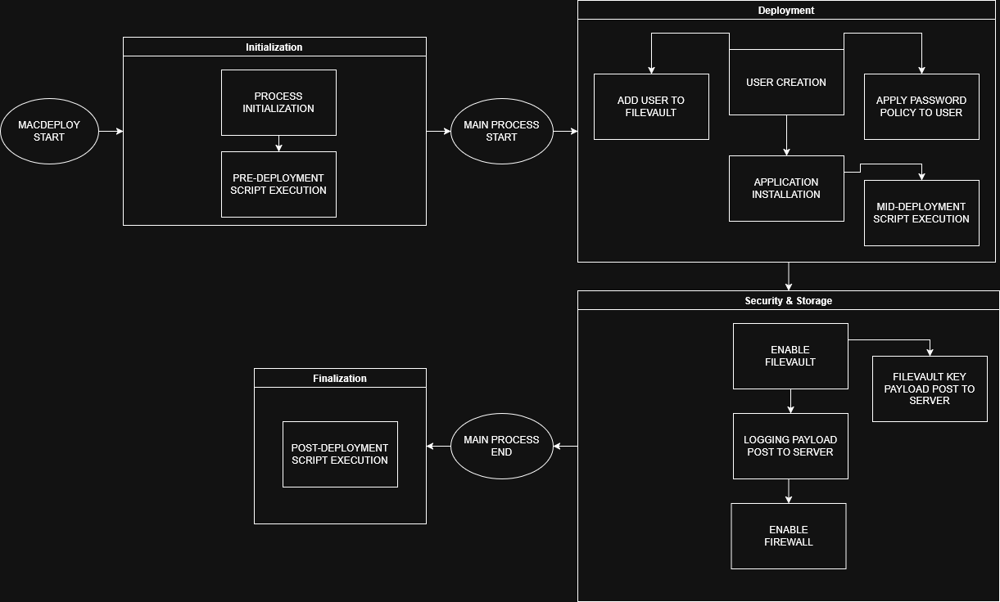

<div align="center">
  

  <h3 align="center">
    MacDeploy
  </h3>

  <p align="center">
    An IT solution for MacBook deployment.
  </p>
</div>

## About the Project

Looking to automate MacBook deployments? No problem! 

*MacDeploy* is a light-weight server and CLI automation tool used to deploy MacBooks with minimal manual interactions 
needed. It features:
- Automation of package installation, DMG extraction, user creation, admin tools, script executions, and more.
- A lightweight file server to facilitate client-server communication and file distributing.
- Automated storage of the FileVault key to the server when generation.
- Password policies for user created accounts.
- Uses HTTPS for encrypted communications.
- Customizable YAML configuration.

***DISCLAIMER***: MacDeploy is provided only to automate MacBook deployment. Securing and management of the 
hardware itself is the responsibility of the user.

The HTTPS file server was built with the intention to be running on a *secure, private network*.
There is *no additional security* implemented to handle a public facing server.

### Powered By

[](https://go.dev/)
[](https://www.python.org/)
[](https://www.docker.com/)


## Table of Contents

- [Workflow](#workflow)
- [Getting Started](#getting-started)
  - [Prerequisites](#prerequisites)
  - [Additional Information](#additional-information)
- [Usage](#usage)
  - [Deployment](#deployment) 
  - [Updating](#updating)
- [YAML Configuration](#yaml-configuration)
- [Server and Deployment](#server-and-deployment)
  - [Gunicorn Configuration](#gunicorn-configuration)
  - [Zipping](#zipping)
  - [Server Zipping](#server-zipping)
  - [FileVault](#filevault)
  - [Logging](#logging)
- [Supported MacBook Versions](#supported-macbook-versions)
- [License](#license)
- [Acknowledgements](#acknowledgements)

## Workflow

The general workflow of the program is divided into four groups:
1. *Initialization*: Preparing the state of the program for deployment
2. *Deployment*: The main automation process
3. *Security & Storage*: FileVault, Firewall, and server-client communication for payloads
4. *Finalization*: Post-deployment process, last finishes and clean up

General workflow:

1. Process start
2. Program initialization -> Pre-deployment script execution
3. Main process start
4. User creation -> Add user to FileVault -> Apply password policies to user
5. Application installation -> Mid-deployment script execution
6. FileVault process -> FileVault key payload submission
7. Logging payload submission
8. Firewall process
9. Main process end -> Post-deployment script execution

<p align="center">
  
</p>

## Getting Started

The following code block sets up the server, Docker containers, and 
*if a valid config YAML file* exists in the root, create the deployment files
(ZIP file of `dist` including the binary creation `macdeploy`).

```bash
git clone https://github.com/bobllor/MacDeploy
cd macdeploy

# checks out the latest release tag
git checkout $(git describe --tags $(git rev-list --tags --max-count=1))

bash build.sh -z
```

Do not use `build.sh` when trying to *create a new ZIP file or updating the repository*. The following scripts
are for these two use cases respectively:
1. `go_zip.sh`: Creates the ZIP file of `dist`. This requires a valid config YAML file in the root. 
2. `update.sh`: Updates the repository, checks out the latest tag release, rebuilds the Docker containers,
creates a new binary, and starts the Docker containers.

### Prerequisites

The server must **run on a macOS, Unix, or Linux** operating system.
Windows is not supported, but WSL is supported.

Below are the tools and software required on the server before starting the deployment process.
- `Go`
- `docker`
- `docker compose`
- `git`
- `zip`

`zip`, `unzip`, and `curl` are required on the clients. MacBook devices have these installed by default.

### Additional Information

About the script `build.sh`:
- Flag `-z` to generate the ZIP file. This *requires the YAML configuration file* to be present.
  - When combined with `-x`, this creates the `x86-64` binary for Intel-based MacBooks.
- It *only creates the Docker containers*, it does not start them.
- It removes the Docker volume, which is only used for the server code.

**IMPORTANT**: Before usage, the *YAML* configuration is required to be created in order for the deployment binaries to work 
properly. Click [here](#yaml-configuration) to get started.

`go_zip.sh` is used to generates the *deployment binaries* and creates the ZIP file. 

The binaries are located in the `dist` directory and the ZIP file is located in the `zip-build` directory.
In order for the binaries to work, *the YAML configuration must be configured prior* to executing `go_zip.sh`.
- A binary is generated used for *ARM-based MacBooks*: `macdeploy`.
- If the `-x` flag is included when running `go_zip.sh`, it also creates the binary for *Intel-based MacBooks*:
`x86_64-macdeploy`.

As Intel MacBooks are being phased out, the following examples will be using `macdeploy`, however the 
commands will be the same if the *Intel* version is used.

## Usage

Before starting, the client devices *must be connected to the same network* as the server.
This tool was built in mind of being on the same local network.

### Deployment

All commands will be entered on the terminal of the deploying device.

Replace `SERVER_IP_DOMAIN` with the IP or domain name of your server. Do note that this *must
be reachable* through the Docker container.

```shell
curl https://SERVER_IP_DOMAIN:5000/api/packages/deploy.zip -o deploy.zip --insecure && \
unzip deploy.zip

./dist/macdeploy
```

The binary supports *flags* and has sub-commands which can be found [here](#deployment-options).

### Updating

There is a script called `update.sh` that automatically updates the repository,
checks out the latest tag, and recreates the binary, Docker containers, and
starts the containers. This is *only available for release v1.2.3 and above*:

```shell
bash update.sh
``` 

## YAML Configuration

The YAML configuration file is used for configuring the binary and must be 
***configured prior to compiling the binary***.
This file is *embedded into the binary*, meaning any new updates will require a new binary to be generated
via `bash go_zip.sh`. 

The YAML file *must be named `config`* and can end in `.yaml`, `.yml`, `.YAML`, or `.YML`. 
A *hard link* will be created from the root file into the embeded folder for the binary to load
in memory.

A sample file can be found in the repository. To read more about the YAML requirements,
[click here](./docs/config-yaml.md).

## Server and Deployment

The server is ran with Flask over an HTTPS connection on a Docker container. 
It uses a self-signed certificate and automatically trusts the connection upon using `curl`.

Due to the devices being wiped and reused, the CA certificate *is not added to the devices*.

### Gunicorn Configuration

In the root directory is the `gunicorn.conf.py` file, the configuration for the server.
By default there are three values defined: the preload status, log level, and number of workers.
- It is recommended to keep the preload status enabled, ensuring the thread locks work during the ZIP file update.
- The worker amounts defaults to four. Additional workers beyond that are unnecessary, depending on the amount of device
deployments.

These can be modified as needed, based on the [Gunicorn's documentation](https://docs.gunicorn.org/en/stable/settings.html).

Any changes to the configuration *will require a reset of the server*, but does not require the containers to be rebuilt.

### Zipping

When generated, the ZIP file is placed inside the `zip-build` directory in the project's root directory.

The *deployment binary reads all files* in the `dist` directory, which is the directory containing
deployment files. These files include packages, scripts, and DMG files, which
are needed to be on the client device for preparation.

Directory structure does not matter in `dist`, the search and download process is 
done recursively. It is recommended to create separate directories in order
to prevent naming conflicts. Some *packages may require config files* alongside the installer, which separate
directories resolves this conflict.

It is *important to update the ZIP file after any changes*, running `bash go_zip.sh` will generate a new ZIP file
and deployment binaries.

### Server Zipping

The server contains an endpoint used for updating and creating (if missing) the ZIP file. 
This is intended for use with the `zip-updater` container in Docker.
- The ZIP file update/creation *works similar to* the `zip` command on Linux.

It *does not create the binary*, the binary is generated via `bash scripts/go_zip.sh`.

The container accesses the endpoint *every 2 hours*, which can be modified inside the `compose.yml` file:
```yaml
zip-updater:
  build:
    args:
      TIMER: 2h # valid arguments: [0-9]+[HMShms]
```

Expected arguments are numbers followed by H, M, or S; hours, minutes, and seconds respectively.
The script *uses seconds for the timer*, with H and M converting into seconds. If S is used, the script
will use the argument as-is.
- The timer is automatically converted to seconds, e.g. `3H` -> `10800`.
- The argument is case insensitive.
- In the event of a parsing failure, it will always default back to 2 hours or 7200 seconds.

### FileVault

FileVault is recommended to be turned on for security purposes. Apple expects FileVault to be on, and a majority
of the deployment process relies on FileVault being enabled.

Upon successful execution, the key will be generated. This key *is not logged on the client* but will be 
outputted onto the terminal.

The key is sent over HTTPS to the server for storage. It can be found in the `keys` directory, created as a subdirectory
under a parent directory that is the *serial tag* of the device.
If this process fails in any way, the key *must be saved* manually.
- Any created account (not the root/main admin) is removed. 
- Example of a directory structure: `./SERIAL_TAG/1234-5678-9000-ABCD`.

### Logging

When the binary is ran on the client device, all logs will be stored at `~/logs/macdeploy`.
The log file follows the format: `<SERIAL>.YYYY-MM-DD.log`.

When the deployment finishes, the log file is sent over to the server and stored in the
`logs` folder in the project root. When the server receives the data, it will create
a new folder under `logs` with the folder naming style *`YYYY-MM-DD-logs`*.

If there is *an existing log file* for a serial tag, then the *data will be appended* to the file.
Otherwise, a new file will be created under this folder respective to the current date.

## Supported MacBook Versions

Below is a table of supported versions that is confirmed to work.

| Version |
| ------- |
| Ventura 13.0+ |
| Sonoma 14.0+ |
| Sequoia 15.0+ |
| Tahoe 26.0+ |

As of October 27th, 2025, M1 through M4 chips are confirmed working. M5 chips are in progress for testing.

## License

MacDeploy is available under the [MIT License](https://opensource.org/license/MIT).

## Acknowledgements

Special thanks to these resources:

- [Cobra CLI](https://github.com/spf13/cobra)
- [Go YAML](https://github.com/goccy/go-yaml)
- [MD Badges](https://github.com/inttter/md-badges)
- [Flask](https://github.com/pallets/flask)
- [Gunicorn](https://github.com/benoitc/gunicorn)
- Docker
- and various other Python libraries.

---

This was built solo and in my free time, so some features expected with JAMF or other MDM tools may be missing.

Contributions, suggestions, and issues are always welcome.